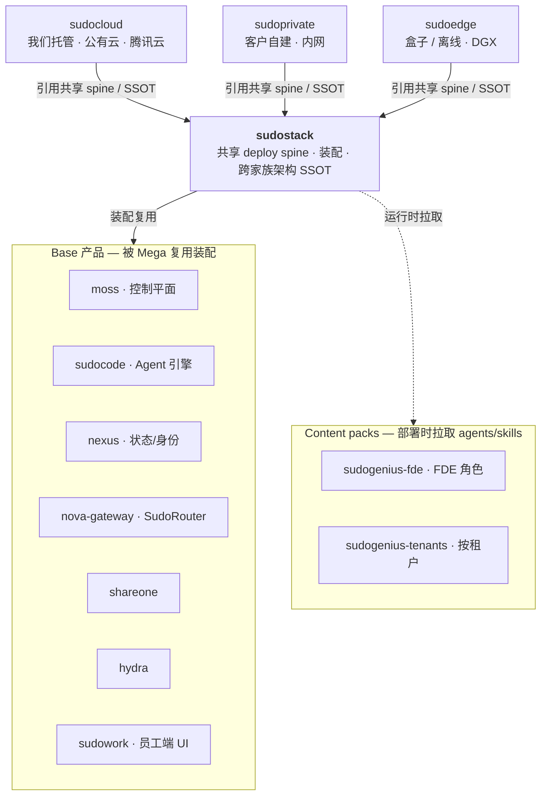
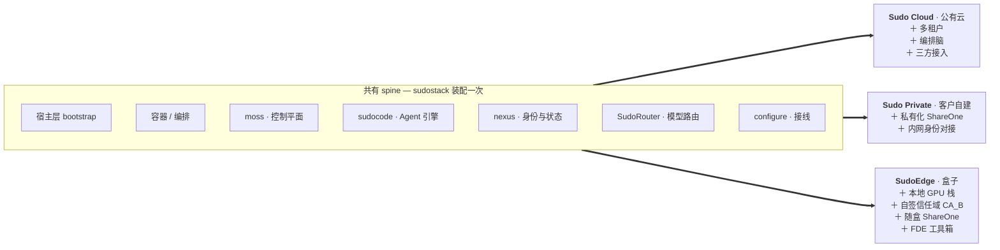

# sudostack

顶层装配 repo：以 submodule 引用各 **Base product** 与 **Mega-product**，并作为**跨全家族技术架构 SSOT** 的落位。

## 两层产品模型

| 层 | 成员 |
|---|---|
| **Platform** | **Sudo Atlas** —— 服务端平台本身（moss 控制平面 + sudocode 引擎 + nexus 身份/状态 + SudoRouter） |
| **Mega-product**（面向客户的**托管形态**，同源） | Sudo Cloud（我们托管 · 公有云）· Sudo Private（客户自建 · 内网）· SudoEdge（盒子/离线） |
| **Base product**（底层 repo，被复用） | sudocode · nexus(+nexus-vfs, `nexi-lab`) · nova-gateway(=SudoRouter) · moss(中控) · hydra(编排/调度) · shareone · ai-dev-browser · password-agent |
| **UI** | SudoWork（纯 UI，repo `sudowork`，Harness=sudocode） |
| **Agent 集** | SudoGenius（领域包：本体/规则/资产/eval） |

### 命名：两个轴，别压成一个

**Sudo Atlas 命名的是「服务端平台」，不是某个部署位置。**「跑在谁的机器上」是另一个轴，也就是面向客户的那组名字：

| 名字 | 谁托管 | 有 Atlas 吗 |
|---|---|---|
| **Sudo Cloud** | 我们（公有云） | 有 |
| **Sudo Private** | 客户（自己的网络） | 有 |
| **SudoEdge** | 随我们做的盒子出厂 | 有 |
| **Sudo Local** | 没人 —— SudoWork ＋ 内嵌 sudocode 单机跑 | **没有** |

**`Sudo Local` 就是这两个轴不能压成一个的原因**：它不是「Atlas 部署在本地」，而是**根本没有 Atlas**。所以 Atlas 命名平台，cloud / private / edge / local 命名托管形态。

用户视角只会看到「本地 / 云端」；`Atlas` 是 IT 采购看的 SKU 名，终端用户不该看到。

Mega-product 由 Base product 装配复用；三种托管形态共享本 repo 的 submodule 引用。

## 依赖关系

三个托管形态**同源、平行**地引用 sudostack（共享 deploy spine + 架构 SSOT）；sudostack 装配 Base 产品，部署时按需拉取 Content packs。



## 装配清单（profile）

三个 Mega 不是三套架构，是**同一条 spine 的三张装配清单**：spine 在 sudostack 装配一次，每个形态只声明自己额外要什么。



盒子形态刻意**不含 hydra 与多租户** —— 前者是开发期编排、后者是云侧租户隔离，都不进交付物。离线形态不是第四个产品，是 SudoEdge 这份清单关掉出站协作后的同一份装配。

## 架构 SSOT

- **产品架构说明书（订正版）** — `docs/ARCHITECTURE.md`（remote-url 至 ShareOne）：产品分层、六契约、AgentSpec 语义。
- **Agent 存储金标准** — `sudocode/docs/design/agent-context-storage-matrix.html`：context/memory/session/storage 物理模型。
- **sudocode 接入 PRD** — `sudocode/docs/design/`：sudocode 如何落地 matrix。

多文档明确唯一职责、互相 reference 不复制。权威「repo → 责任人 / 编制 / 部署拓扑」见组织文档（leader-only）。

## submodule 计划

```
base/sudocode        base/nova-gateway    base/moss        base/hydra
base/shareone        base/ai-dev-browser  base/password-agent
mega/sudocloud      mega/sudoprivate    mega/sudoedge
ui/sudowork
```

> nexus / nexus-vfs 位于 `nexi-lab`（跨 org），作为外部依赖引用，不作为本 repo submodule。
