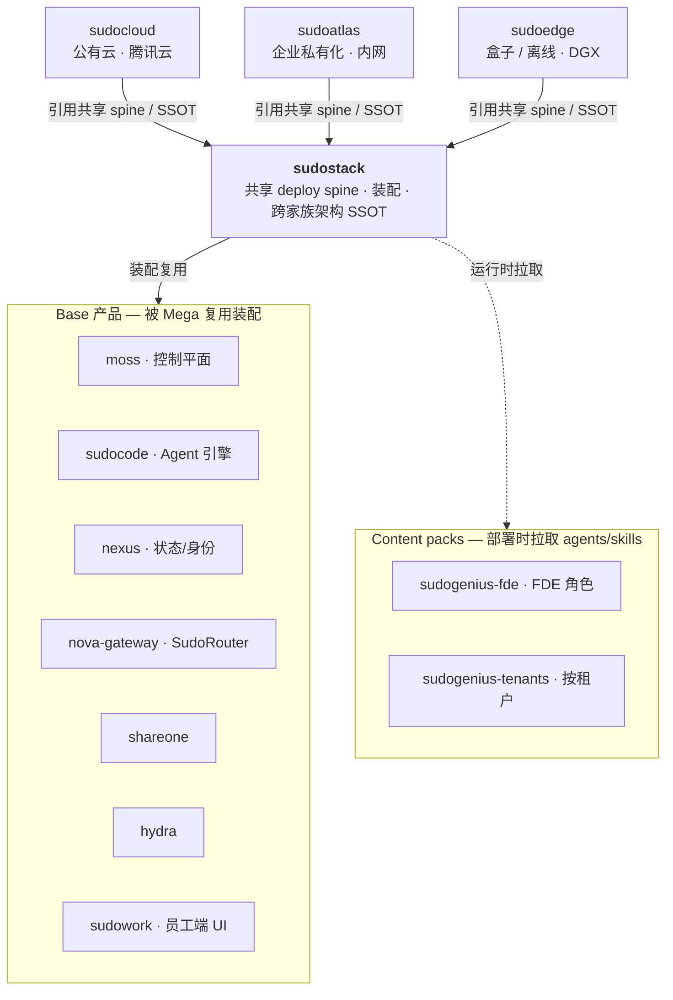
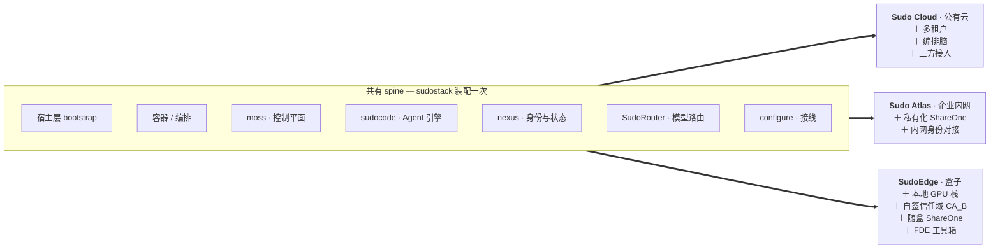

# sudostack

顶层装配 repo：以 submodule 引用各 **Base product** 与 **Mega-product**，并作为**跨全家族技术架构 SSOT** 的落位。

## 两层产品模型

| 层 | 成员 |
|---|---|
| **Mega-product**（面向客户的组合，同源、部署形态不同） | Sudo Atlas（企业私有化）· Sudo Cloud（公有云同源）· SudoEdge（盒子/离线） |
| **Base product**（底层 repo，被复用） | sudocode · nexus(+nexus-vfs, `nexi-lab`) · nova-gateway(=SudoRouter) · moss(中控) · hydra(编排/调度) · shareone · ai-dev-browser · password-agent |
| **UI** | SudoWork（纯 UI，repo `sudowork`，Harness=sudocode） |
| **Agent 集** | SudoGenius（领域包：本体/规则/资产/eval） |

Mega-product 由 Base product 装配复用；Atlas 与 Cloud 共享本 repo 的 submodule 引用。

## 依赖关系

三个 Mega 产品**同源、平行**地引用 sudostack（共享 deploy spine + 架构 SSOT）；sudostack 装配 Base 产品，部署时按需拉取 Content packs。



## 装配清单（profile）

三个 Mega 不是三套架构，是**同一条 spine 的三张装配清单**：spine 在 sudostack 装配一次，每个形态只声明自己额外要什么。



盒子形态刻意**不含 hydra 与多租户** —— 前者是开发期编排、后者是云侧租户隔离，都不进交付物。离线形态不是第四个产品，是 SudoEdge 这份清单关掉出站协作后的同一份装配。

## 架构 SSOT

- **产品架构说明书（订正版）** — `docs/ARCHITECTURE.md`（remote-url 至 ShareOne）：产品分层、六契约、AgentSpec 语义。
- **Agent 存储金标准** — `sudocode/docs/design/agent-context-storage-matrix.html`：context/memory/session/storage 物理模型。
- **sudocode 接入 PRD** — `sudocode/docs/design/`：sudocode 如何落地 matrix。

多文档明确唯一职责、互相 reference 不复制。权威「repo → 责任人 / 编制 / 部署拓扑」见组织文档（leader-only）。

## submodule 计划

```
base/sudocode        base/nova-gateway    base/moss        base/hydra
base/shareone        base/ai-dev-browser  base/password-agent
mega/sudoatlas      mega/sudocloud      mega/sudoedge
ui/sudowork
```

> nexus / nexus-vfs 位于 `nexi-lab`（跨 org），作为外部依赖引用，不作为本 repo submodule。
