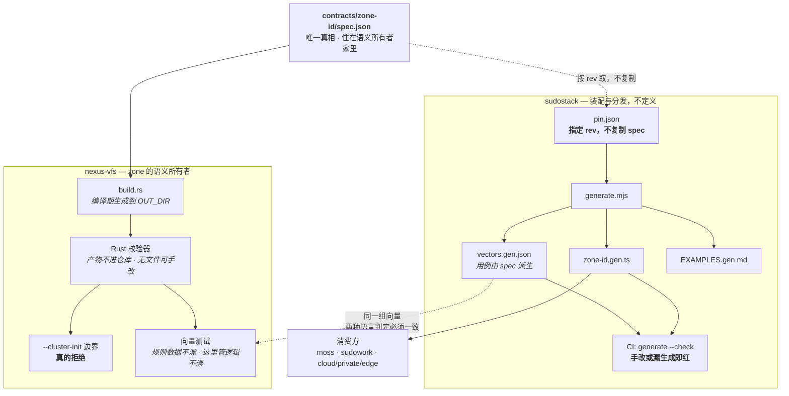
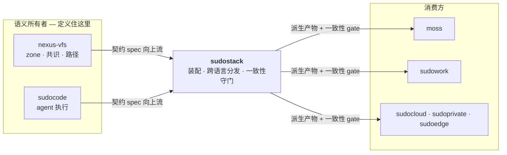
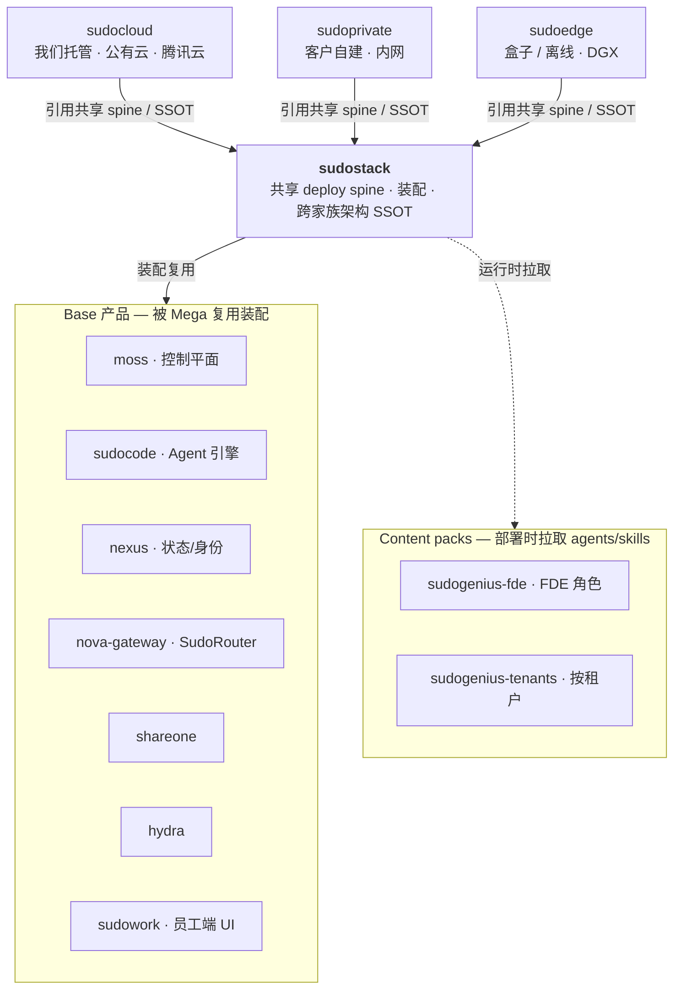
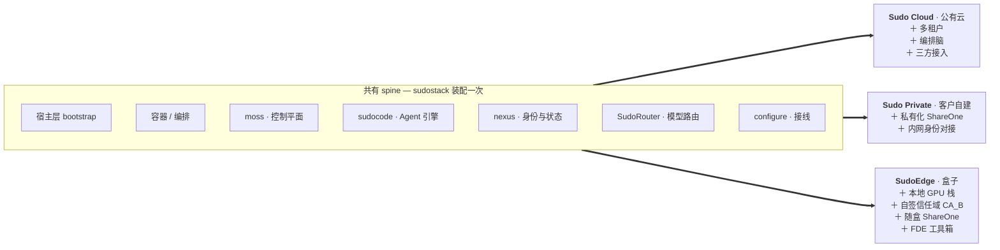

# sudostack

顶层装配 repo：以 submodule 引用各 **Base product** 与 **Mega-product**，并作为**跨全家族技术架构 SSOT** 的落位。

## 契约怎么落地（先读这条）

> **能在代码里强制的，绝不手写第二遍。**

一条规则写在文档里、没有任何东西能让它失败，那它不是规则 —— 它更糟：它让读者以为这件事有人管着。
所以每条跨仓库定义都必须说清楚自己**靠什么失败**。

规则分两种，判据不同，别混着用。

### 形状类：字段、格式、边界值

判据是**手改一个生成产物能不能一路跑到生产**。

| 档 | 手段 | 手改能不能跑到生产 |
|---|---|---|
| **编译期** | Rust `build.rs` 生成到 `OUT_DIR` + `include!` —— **产物不进仓库** | **不能**：没有可改的文件 |
| **CI** | 产物进仓库但文件名带 `.gen.`、文件头写明来源与再生成命令；CI 跑 `generate && git diff --exit-code` | **不能**：改了就红 |
| **只能靠人看** | 写进 README 或 ADR，**并显式标注「当前未强制」** | **能** —— 所以必须标注 |

### 行为类：顺序、状态迁移、「什么情况下不该发生什么」

类型系统一条都抓不住：一个下游可以把契约包完整 import、类型全对，然后在 reject 路径上照样写一条执行记录，一次都不报错。
判据换成**一个违反规则的实现能不能一路绿**。

| 档 | 手段 | 违反了会怎样 |
|---|---|---|
| **让它无法被构造** | 把状态**推导**出来而不是**声明**出来：非法组合根本拼不出来，也就没有「记得检查」这回事 | 压根写不出来 |
| **对真实产物断言可观测结果** | 起真的二进制/真的服务，断言外部看得见的结果（拒绝启动并说出原因、盘上的字节、RPC 的裁决），**不建模状态机** | 真跑一遍就红 |
| **只能靠人看** | 同上，**并显式标注「当前未强制」** | 不会红 —— 所以必须标注，而且要可计数 |

第一档是唯一不需要同步、不需要维护的一档，因为违规状态不存在。落到行为类条款上先问一句：
**这条能不能改成「推导出来的」而不是「配置出来的」？** 能改的比想象中多。

第二档**刻意不建模状态机**。为行为类条款写一套场景向量，等于把状态机实现第二遍 —— 它会同时偏离两边，而且因为是绿的所以没人怀疑。
向量只适合跨语言的纯函数规则（zone-id 就是理想情形）。如果一条规则非得靠向量才能表达，通常说明该回去试第一档。

### 未强制必须可计数

第三档是合法的 —— 有些东西确实没法机器校验。但它必须**承认自己是第三档**，不能穿着规范的外衣。
一句读起来像规则、实际没人校验的话，比不写这句话更糟。

光贴标签不够：**没人数的标签，会退化回它本来要取代的那段散文。**
所以每条规范性条款带一个 `enforced_by`，指向一个测试 id、一个生成常量或一个类型；
CI 校验这个字段存在、且指向的东西真的存在（测试名 grep 不到、文件不在，就红）。
`enforced_by: none` 是合法值 —— 它的作用是让「没强制」变成一个**能数、能看趋势**的数字。

### 走通的样板：zone-id

第一条走完全程的规则。每个箭头都是机器执行的，没有一步依赖「有人记得」：



**读这张图的三个要点：**

1. **左边那条虚线是全图的关键** —— sudostack **不持有定义**，只按 rev 取。复制就是第二份真相，从复制那天开始漂。而「用哪个 rev」由我们**已经在做**的 nexus-vfs pin 回答，不新增一个需要有人记得的东西。
2. **Rust 侧没有可手改的文件**（产物在 `OUT_DIR`），TS 侧有 —— 因为 TypeScript 没有等价的编译期钩子。所以 TS 那半靠 CI 的 `--check` 兜底，这是两种语言能力差异决定的，不是偏好。
3. **底下那条虚线管的是另一件事**：共用 spec 让**规则数据**不可能漂，但**逻辑**会 —— 两种语言是两份实现，一份可能在读着相同常量的情况下漏掉某个 case。同一组向量两边都跑，才把这条堵上。

实测：同一组 11 个向量，Rust 与 TypeScript 判定完全一致；把 spec 里 `max` 从 63 改成 40，两边的测试**自动**失败，没有人执行过「重新生成」。

**这条规则落地第二天就抓出了提案者自己的错误**：写进 Sudo Cloud 计划的 `zone id = org:<organizations.id>` 是非法的（冒号不在字符集内，位置 3）。裸 UUID 合法、`org-<uuid>` 合法。这比任何论证都更能说明「规范要可执行」。

## 两个方向，别弄反（代码依赖 vs 产品装配）

sudostack 是**产品组合的 base，不是代码的 base**。它在中间：下游是 Base product，上游是 Mega-product。
下面那张产品装配图的箭头，和这张代码/契约依赖图的箭头，**方向是相反的** —— 混淆这两者会把定义放错仓库。



**定义住谁家的判据：这个概念的语义所有者是谁。**

| 概念 | 住哪 | 为什么 |
|---|---|---|
| `zone_id`、共识边界、路径 | **nexus-vfs** | zone 是它的内核概念，`create_zone` 在它那里。放别处会让上游依赖下游，且成环 |
| Task / Attempt 生命周期、产品契约版本 | **sudostack** | 我们的产品语义，nexus 里没有对应概念 |

反过来放会出两个问题：**依赖成环**（sudostack 装配 Base product，Base product 又依赖 sudostack），
以及**规则和执行点不在同一个仓库** —— 那样 `build.rs` 这类编译期强制根本没法用。

## 两层产品模型

| 层 | 成员 |
|---|---|
| **Platform** | **Sudo Atlas** —— 服务端平台本身（moss 控制平面 + sudocode 引擎 + nexus 身份/状态 + SudoRouter） |
| **Mega-product**（面向客户的**托管形态**，同源） | Sudo Cloud（我们托管 · 公有云）· Sudo Private（客户自建 · 内网）· SudoEdge（盒子/离线） |
| **Base product**（底层 repo，被复用） | sudocode · nexus(+nexus-vfs, `nexi-lab`) · nova-gateway(=SudoRouter) · moss(中控) · hydra(编排/调度) · shareone · ai-dev-browser · password-agent |
| **UI** | SudoWork（纯 UI，repo `sudowork`，Harness=sudocode） |
| **Agent 集** | SudoGenius（领域包：本体/规则/资产/eval） |

### 命名：两个轴，别压成一个

**Sudo Atlas 命名的是「服务端平台」，不是某个部署位置。**「跑在谁的机器上」是另一个轴，也就是面向客户的那组名字：

| 名字 | 谁托管 | 有 Atlas 吗 |
|---|---|---|
| **Sudo Cloud** | 我们（公有云） | 有 |
| **Sudo Private** | 客户（自己的网络） | 有 |
| **SudoEdge** | 随我们做的盒子出厂 | 有 |
| **Sudo Local** | 没人 —— SudoWork ＋ 内嵌 sudocode 单机跑 | **没有** |

**`Sudo Local` 就是这两个轴不能压成一个的原因**：它不是「Atlas 部署在本地」，而是**根本没有 Atlas**。所以 Atlas 命名平台，cloud / private / edge / local 命名托管形态。

用户视角只会看到「本地 / 云端」；`Atlas` 是 IT 采购看的 SKU 名，终端用户不该看到。

Mega-product 由 Base product 装配复用；三种托管形态共享本 repo 的 submodule 引用。

## 依赖关系

三个托管形态**同源、平行**地引用 sudostack（共享 deploy spine + 架构 SSOT）；sudostack 装配 Base 产品，部署时按需拉取 Content packs。



## 装配清单（profile）

三个 Mega 不是三套架构，是**同一条 spine 的三张装配清单**：spine 在 sudostack 装配一次，每个形态只声明自己额外要什么。



盒子形态刻意**不含 hydra 与多租户** —— 前者是开发期编排、后者是云侧租户隔离，都不进交付物。离线形态不是第四个产品，是 SudoEdge 这份清单关掉出站协作后的同一份装配。

## 架构 SSOT

- **产品架构说明书（订正版）** — `docs/ARCHITECTURE.md`（remote-url 至 ShareOne）：产品分层、六契约、AgentSpec 语义。
- **跨仓语义 ADR（Proposed）** — `docs/adr/`：标识与生命周期、Zone 与租户、Agent principal 与版本、Task 与执行解析、契约版本化、transcript/overlay。论证与原始语义冻结指南见 `docs/design/`。
- **Agent 存储金标准** — `sudocode/docs/design/agent-context-storage-matrix.html`：context/memory/session/storage 物理模型。
- **sudocode 接入 PRD** — `sudocode/docs/design/`：sudocode 如何落地 matrix。

多文档明确唯一职责、互相 reference 不复制。权威「repo → 责任人 / 编制 / 部署拓扑」见组织文档（leader-only）。

## submodule 计划

```
base/sudocode        base/nova-gateway    base/moss        base/hydra
base/shareone        base/ai-dev-browser  base/password-agent
mega/sudocloud      mega/sudoprivate    mega/sudoedge
ui/sudowork
```

> nexus / nexus-vfs 位于 `nexi-lab`（跨 org），作为外部依赖引用，不作为本 repo submodule。
