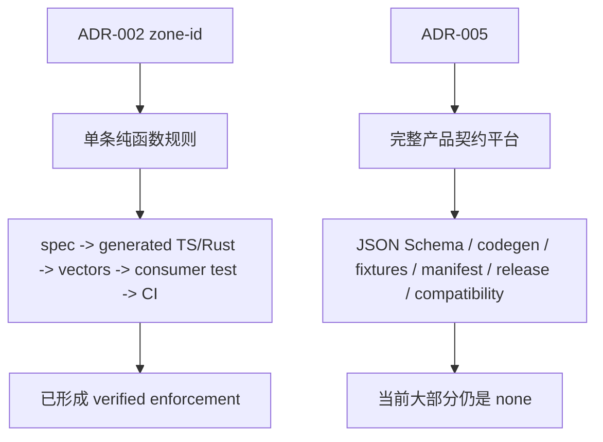
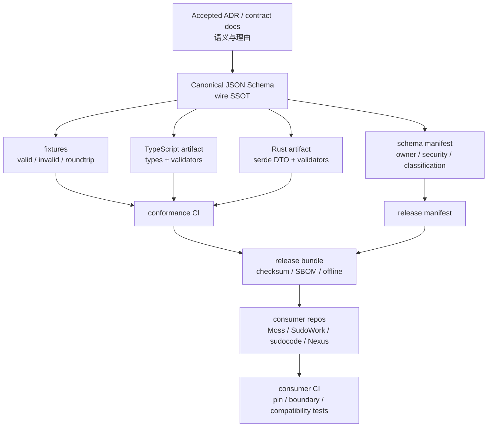

# ADR-005 现状与落地方案

> 日期：2026-09-15  
> 范围：解释 ADR-005 当前实现状态、ADR-002 zone-id 样板的意义，以及如何完整实现 ADR-005 中可机器强制的规则。  
> 结论先行：ADR-005 已在 `sudostack` 内形成第一条 `common/v1` contract 闭环，但还不是完整跨仓 Contract 平台；后续还需要真实 consumer boundary、完整 release bundle/SBOM/offline artifact，以及独立 `sudo-contracts` 仓库治理。ADR-002 的 zone-id 是已经跑通的一条端到端样板，本轮实现把这种方法扩展到了 schema/codegen/fixtures/compatibility/manifest/release gate。

---

## 1. 当前结论

### 1.1 ADR-005 当前是什么

ADR-005 定义的是跨仓产品契约的版本、分发、兼容和治理规则。它覆盖的内容包括：

- JSON Schema 作为 wire SSOT；
- `api_version` / `kind` 版本规则；
- TypeScript / Rust / Python / Go 等语言 artifact；
- valid / invalid / roundtrip fixtures；
- compatibility matrix；
- release manifest；
- checksum / SBOM / offline bundle；
- consumer pin 与升级流程；
- unknown major / unknown optional 兼容行为；
- breaking change 升 schema major 的兼容策略。

这些是完整 Contract 平台需要具备的能力。

### 1.2 ADR-005 当前实现状态

当前 `sudostack` 已经完成的是：

- 有 `@sudo/contracts` v0.x 私有 npm package；
- package 当前承载在 `sudostack` Git 仓库中；
- `package.json` 暴露了 `./zone-id` 与 `./common/v1`；
- Moss 通过 GitHub 40 位 commit SHA 依赖 `sudostack`；
- zone-id 生成物、向量、TS conformance test、ADR enforcement checker 已经纳入 CI；
- `common/v1` 已有 canonical JSON Schema、valid/invalid/roundtrip fixtures、TS generated artifact、Rust crate、schema manifest、release manifest、compatibility baseline 和 consumer matrix；
- ADR-005 的未认领规范条款已经全部标注，`untagged` 已降为 0。

但 ADR-005 中仍有一部分平台级/治理级规则没有真实实现为机器强制，例如完整独立仓库、所有 contract family、跨仓真实 boundary tests、SBOM/offline bundle 和组织级 review gate。因此当前 ADR-005 的 enforcement 结果是：

```text
ADR-005:
  verified: 16
  none: 33
  untagged: 0
```

这里的 `none` 不是失败，而是诚实说明：这些剩余规则目前还没有测试、生成器、schema、release 工具、跨仓 CI gate 或外部治理机制能让违反行为自动失败。

### 1.3 完整实现目标

本方案的目标是完整实现 ADR-005 中**可以被机器强制**的规则，并对少数治理类规则提供尽可能强的外部 enforcement。

完成态应达到：

- `sudostack` 中存在 canonical JSON Schema、fixtures、生成器、manifest、release/compatibility 检查；
- TypeScript 与 Rust 至少具备可发布 artifact，并能跑 shared fixtures；
- Moss、SudoWork、sudocode、Nexus 至少各有一个 boundary adapter test；
- consumer dependency 使用 exact pin，并由工具检查；
- breaking schema change 会被 compatibility checker 判定；
- release manifest、schema digest、artifact digest、checksum/SBOM/offline bundle 能被验证；
- ADR-005 中大部分 `enforced_by: none` 可改为真实 `test:`、`file:`、`const:` 或 `type:` target；
- 剩余无法完全机器强制的治理条款，需要明确依赖 GitHub branch protection、CODEOWNERS、required review 或 release approval，并继续标出边界。

也就是说，目标不是“把文档标绿”，而是让违反 ADR-005 核心规则的改动在 CI、生成、发布或 consumer 边界测试中失败。

### 1.4 ADR-002 的 zone-id 是什么状态

ADR-002 中的 zone-id 是已经跑通的样板。它不是完整 Contract 平台，但它证明了跨仓规则可以按以下方式落地：

- 规则定义住在语义所有者仓库；
- `sudostack` 只 pin 上游 revision，不复制 spec；
- 非 Rust 消费方从 pinned spec 生成 artifact；
- vectors 从 spec 派生；
- CI 检查生成物没有漂移；
- consumer 通过 package 引入生成物；
- consumer boundary test 证明规则真的被调用。

当前 zone-id 已经覆盖：

- 长度 3-63；
- 小写字母数字和 hyphen；
- 不以 hyphen 开头或结尾；
- reserved id 由 nexus-vfs 侧拒绝；
- Moss 在生成 nexusd 参数前调用 validator，拒绝非法 `clusterInit`；
- 手改生成物会被 `generate --check` 抓住；
- TypeScript validator 与 vectors 不一致会红。

---

## 2. 两者关系

可以把两者理解成：

```text
zone-id = 一条已经跑通的规则样板
ADR-005 = 要把这种做法扩展成完整契约平台的规则书
```

zone-id 证明了方法可行，但不能证明 ADR-005 已经完成。



关键区别：

| 项目 | ADR-002 zone-id | ADR-005 |
|---|---|---|
| 规则规模 | 单条 ID 格式规则 | 一整套产品契约平台 |
| SSOT | nexus-vfs `contracts/zone-id/spec.json` | 尚未建立完整 canonical JSON Schema |
| 生成物 | TS validator / vectors；Rust 侧 build-time 生成 | 仅有 zone-id 相关生成物 |
| CI | 已覆盖生成物和 TS conformance | 尚未覆盖完整 schema/fixture/release 流程 |
| consumer | Moss 已接入 zone-id validator | 其他 contract family 尚未接入 |
| enforcement 状态 | 已有 verified 条款 | 当前 ADR-005 全部为 none |

---

## 3. 为什么不能直接把 zone-id 当成 ADR-005 已实现

zone-id 的规则是纯函数：

```text
validateZoneId(id) -> accepted / refused
```

所以它适合用 spec + vectors + validator 来证明。

ADR-005 里有很多规则不是纯函数，而是平台流程和治理规则，例如：

- 每个 wire object 包含 `api_version` 和 `kind`；
- unknown major 拒绝；
- unknown optional 忽略；
- breaking change 升 schema major；
- release 生成 manifest；
- 每个 schema 具备 data classification；
- consumer 不依赖浮动 branch；
- release 具备 checksum / SBOM / offline bundle。

这些规则需要不同类型的 enforcement：

| 规则类型 | 需要的 enforcement |
|---|---|
| 字段形状 | JSON Schema + valid/invalid fixtures |
| 多语言一致性 | TS/Rust/Python/Go parse + roundtrip |
| breaking change | schema diff / compatibility checker |
| release 完整性 | release manifest + checksum/SBOM/offline bundle check |
| consumer 行为 | consumer matrix + boundary tests |
| dependency pin | lockfile/revision drift checker |
| governance | manifest owner/security/review metadata |

因此，正确做法不是“复制 zone-id 目录”，而是把 ADR-005 拆成多个 zone-id 式闭环。

---

## 4. 目标架构

后续完整落地后，ADR-005 应该形成这样的链路：



这个链路的判据与 zone-id 一样：

> 违反规则时，要有明确的东西会失败。

---

## 5. 完整实现路线图

完整实现分为九个阶段。P0-P3 建立第一个 contract 闭环；P4-P6 建立 compatibility/release 闭环；P7 接入真实 consumer；P8 回填 ADR-005 enforcement，使文档状态与真实机器约束一致。

```mermaid
flowchart LR
  P0["P0 v0 分发检查"] --> P1["P1 common/v1 schema"]
  P1 --> P2["P2 TypeScript artifact"]
  P2 --> P3["P3 Rust artifact + roundtrip"]
  P3 --> P4["P4 compatibility checker"]
  P4 --> P5["P5 manifest + release manifest"]
  P5 --> P6["P6 consumer matrix + exact pin gate"]
  P6 --> P7["P7 consumer boundary tests"]
  P7 --> P8["P8 ADR-005 enforcement 回填"]
```



阶段完成后，ADR-005 的 `none` 应逐批减少，而不是一次性手工改成 `verified`。

### P0：把当前 v0.x 分发事实固化为机器检查

目标：先把已经存在的 `@sudo/contracts` v0.x Git 分发方式变成可检查事实。

可做内容：

- 检查 `package.json` package name 为 `@sudo/contracts`；
- 检查 `private: true` 保持，避免误发 npm registry；
- 检查 `exports["./zone-id"]` 指向生成物；
- 检查生成物文件名带 `.gen.`；
- 检查 `.github/workflows/contracts.yml` 跑 `contracts/generate.mjs --check`；
- 检查 Moss 当前依赖使用 40 位 SHA；
- 可选：新增脚本检查 consumer dependency 不能是 `main` / `dev` / 短 SHA。

完成后，可将 ADR-005 中少量 v0.x 分发规则从 `none` 改成 `verified`。

本阶段修改范围：

- `sudostack/package.json`；
- `sudostack/.github/workflows/contracts.yml`；
- `sudostack/tools/check-v0-distribution.mjs`；
- 只读核查 `moss/package.json` 与 `moss/bun.lock`；
- 若检查 Moss pin，工具参数使用 `SUDOSTACK_REPOS_ROOT=/Users/yobach/VSCodeProject`。

本阶段不完成完整 schema 平台，但它是后续所有阶段的分发基线。

### P1：建立 `common/v1` 最小 JSON Schema

目标：选最小、低争议、可复用的 common family，做第一条真正 ADR-005 风格 contract。

建议从以下对象开始：

- `ContractEnvelope`：`api_version` + `kind`；
- `ResourceRef`：`zone_id` + `path` + optional digest/version/media metadata；
- `ErrorInfo`：`code` + `message` + `retryable` + optional details/cause_ref；
- `Digest`：带算法前缀；
- `Rfc3339Timestamp`：UTC string。

需要产出：

```text
schemas/common/v1/*.schema.json
fixtures/valid/common/v1/...
fixtures/invalid/common/v1/...
fixtures/roundtrip/common/v1/...
tools/check-schemas...
```

完成后，可验证：

- 每个 object 有 `api_version` 和 `kind`；
- valid fixtures 被接受；
- invalid fixtures 被拒绝；
- Secret/large payload 的基础 negative fixture 可表达；
- unknown major 拒绝策略可以开始测试。

本阶段修改范围：

- `sudostack/schemas/common/v1/*.schema.json`；
- `sudostack/fixtures/valid/common/v1/...`；
- `sudostack/fixtures/invalid/common/v1/...`；
- `sudostack/tools/check-schemas.mjs`；
- `sudostack/package.json`；
- `sudostack/.github/workflows/contracts.yml`。

完成后，ADR-005 中关于 `api_version`、`kind`、required field、invalid fixture、Secret negative fixture 的部分规则可以开始转为 `verified`。

### P2：TypeScript artifact 与 validator

目标：先让 TypeScript consumer 能像 Moss 用 `zone-id` 一样引用生成物。

需要产出：

- schema 到 TS type/validator 的生成流程；
- `parse` / `safeParse`；
- known constants；
- generated artifact clean diff；
- TS fixture test。

注意：

- 不能手写一份和 schema 分离的 Zod 类型当 SSOT；
- 生成物可以提交，但由 CI 检查 clean diff；
- 若手写 adapter，声明它是 consumer adapter，不是 SSOT。

本阶段修改范围：

- `sudostack/packages/typescript/` 或现有 package export 结构；
- `sudostack/tools/generate/`；
- generated TS artifact；
- TS fixture tests；
- `sudostack/.github/workflows/contracts.yml`。

完成后，ADR-005 中 TypeScript wire types、runtime validators、schema bundle、known constants、parse/safeParse 相关条款可开始转为 `verified`。

### P3：Rust artifact 与 roundtrip

目标：让 Rust 侧能解析相同 fixtures。

需要产出：

- serde DTO；
- validation helper；
- schema/version constants；
- Rust fixture parse test；
- TS/Rust roundtrip 语义等价检查。

注意：

- `nexus-vfs/rust/contracts` 是 kernel/ABI crate，不能冒充产品 contract；
- product contract 应在边界转换为 internal type；
- Rust package 不需要第一天就覆盖所有 family。

本阶段修改范围：

- `sudostack/crates/rust/`；
- Rust fixture tests；
- TS/Rust roundtrip tests；
- `sudostack/.github/workflows/contracts.yml`。

完成后，ADR-005 中 Rust artifact、serde DTO、validation helper、roundtrip 相关规则可以转为 `verified`。

### P4：compatibility checker

目标：让 breaking change 被工具识别。

需要检查：

- 新增 required 字段是 breaking；
- 删除字段是 breaking；
- 改字段类型是 breaking；
- 收紧 validation 是 breaking；
- 改默认安全行为需要新 major；
- 新增 optional 字段在同 major 内允许；
- open code registry 增加值允许；
- closed enum 增加值默认 breaking。

完成后，ADR-005 中“新 major”相关条款才有机会从 `none` 变成 `verified`。

本阶段修改范围：

- `sudostack/tools/compatibility-check/`；
- compatibility fixtures；
- schema diff baseline；
- CI workflow。

完成后，ADR-005 中 breaking change、required field、field deletion、field type change、validation 收紧、新 major 规则可以转为 `verified`。

### P5：manifest 与 release manifest

目标：补上 owner、安全分类、digest 和 release 可追踪性。

需要产出：

- `ContractSchemaManifest`；
- `ContractReleaseManifest`；
- schema bundle digest；
- generated artifact digest；
- owner/security owner/producers/consumers；
- compatibility status；
- release manifest check。

完成后，可强制：

- 每个 schema kind 有 manifest；
- schema 绑定 ADR 和 owner；
- release artifact 可离线校验版本和 digest。

本阶段修改范围：

- `sudostack/manifests/` 或 schema-adjacent manifest 文件；
- `sudostack/tools/release-manifest/`；
- release manifest tests；
- checksum/digest generation；
- CI workflow。

完成后，ADR-005 中 schema manifest、release manifest、owner/security/data classification、artifact digest 相关规则可以转为 `verified`。

### P6：consumer matrix 与 exact pin gate

目标：让“谁支持哪个 family major”变成可检查事实。

需要产出：

```text
compatibility/consumers.yaml
tools/check-consumers...
```

检查内容：

- 每个 consumer 支持哪些 family major；
- consumer dependency 使用 exact pin；
- 不允许 `main` / `dev` 浮动分支；
- lockfile 与 package declaration 一致；
- consumer boundary test 覆盖 unknown major / unknown optional；
- provider 不能提前只发新 major。

本阶段修改范围：

- `sudostack/compatibility/consumers.yaml`；
- `sudostack/tools/check-consumers.mjs`；
- CI workflow；
- 只读检查或轻量适配 Moss/SudoWork/sudocode/Nexus 的 package/lockfile。

完成后，ADR-005 中 consumer support matrix、exact pin、lockfile drift、provider/consumer major 兼容规则可以转为 `verified`。

### P7：接入真实 consumer

目标：让 Contract 平台不只在本仓自洽，而是在业务边界生效。

推荐顺序：

1. Moss：先接 `ResourceRef` / `ErrorInfo` boundary；
2. SudoWork：保留本地 DTO adapter，新增 contract boundary test；
3. sudocode：ACP metadata / runtime boundary；
4. Nexus：product API boundary，不污染 kernel/ABI contracts；
5. SudoRouter：Go structs 和 validation。

原则：

- 不全仓机械替换；
- 只在跨 repo/process/API 边界验证；
- 内部领域模型可以不同，但需要明确 adapter；
- 每个 consumer 独立 PR 升级 pin。

本阶段修改范围：

- `moss/package.json`、`moss/bun.lock`、Moss boundary adapter/test；
- `sudowork/package.json`、SudoWork adapter/test；
- `sudocode` runtime/ACP boundary adapter/test；
- `nexus` product API boundary adapter/test；
- 可选：`nova-gateway` / SudoRouter Go structs 与 validation。

完成后，ADR-005 中“每个 consumer 跑 shared fixtures”“boundary adapter test”“unsupported major test”“unknown optional test”“producer version 非 unknown”等 consumer 侧规则可以转为 `verified`。

### P8：ADR-005 enforcement 回填

目标：在真实代码和 CI 已经存在之后，重新审计 ADR-005，把能机器强制的条款从 `none` 改成真实 target。

需要执行：

1. 跑 `SUDOSTACK_REPOS_ROOT=/Users/yobach/VSCodeProject node docs/adr/enforced-by.mjs --json`；
2. 对 ADR-005 每条 `none` 做 evidence review；
3. 只有完整覆盖整条 clause 的规则，才改为 `test:`、`file:`、`const:` 或 `type:`；
4. 对仍然无法机器强制的治理条款，补充说明依赖的外部机制；
5. 更新 `docs/adr/enforced-by-baseline.json`；
6. 跑生成、schema、compatibility、release、consumer 全部 CI checks。

本阶段完成后，ADR-005 应只剩少量无法由本仓代码完全强制的治理类 `none`。

---

## 6. ADR-005 规则到阶段的映射

| ADR-005 规则类别 | 目标阶段 | 完成后的 enforcement |
|---|---:|---|
| 当前 v0.x package 分发、private package、Git exact pin | P0 | `check-v0-distribution` + workflow |
| JSON Schema 是 wire SSOT | P1-P2 | schema lint + generated artifact clean diff |
| 每个 object 有 `api_version` / `kind` | P1 | valid/invalid fixtures |
| Secret / large payload negative fixtures | P1-P2 | invalid fixtures fail |
| TS validators / parse / safeParse | P2 | TS fixture tests |
| Rust serde DTO / validation helper | P3 | Rust fixture tests |
| TS/Rust roundtrip | P3 | roundtrip tests |
| required/delete/type/validation breaking change | P4 | compatibility checker |
| schema manifest / owner / data classification | P5 | manifest validator |
| release manifest / digest / checksum / offline bundle | P5 | release manifest checks |
| consumer support matrix | P6 | `consumers.yaml` validator |
| exact pin / lockfile drift | P6 | consumer pin checker |
| unknown major / unknown optional consumer behavior | P7 | consumer boundary tests |
| producer version 非 unknown | P7 | producer/boundary tests |
| consumer-local DTO 不得成为 SSOT | P7-P8 | adapter tests + docs + review gate |
| breaking semantic change 必须发新 schema major | P4 + P8 | compatibility checker + ADR review |
| schema owner / security reviewer / migration owner | P5 + 外部治理 | manifest + CODEOWNERS/required review |

---

## 7. 最终完成态

完整实现后，预期状态应接近：

```text
ADR-005:
  verified: 大部分核心工程规则
  none: 少量外部治理或人工评审规则
  untagged: 0
```

不能现实地承诺所有条款都变成 `verified`，因为某些规则天然属于组织流程，例如：

- breaking change 需要 ADR 或 amendment；
- schema owner 与 affected consumer owner review；
- 普通业务 repo PR 不应私自修改跨仓字段含义。

这类规则可通过 CODEOWNERS、branch protection、PR template、required checks、release approval 变得更强，但仍可能需要保留边界说明。

---

## 8. 当前落地状态与剩余工作

### 已完成：P0，让 ADR-005 出现第一批 verified

P0 已在 `sudostack` 内落地。

已完成：

1. 新增 `tools/check-v0-distribution.mjs`；
2. 检查 `package.json`：
   - `name === "@sudo/contracts"`；
   - `private === true`；
   - `exports["./zone-id"] === "./contracts/zone-id/zone-id.gen.ts"`；
3. 检查 `.github/workflows/contracts.yml` 包含：
   - `contracts/generate.mjs --check`；
   - `contracts/zone-id/conformance.test.mjs`；
   - `docs/adr/enforced-by.mjs`；
4. 只读检查 Moss：
   - `moss/package.json` 中 `@sudo/contracts` 使用 40 位 SHA；
   - `moss/bun.lock` 同步；
5. 将脚本加入 `package.json`；
6. 将脚本加入 GitHub workflow；
7. 更新 ADR-005 中对应条款，从 `none` 改为真实 `enforced_by`。

边界：

- 这只能证明当前 v0.x 分发形状，不证明完整 contract 平台。

### 已完成：P1-P6，第一个 JSON Schema / TS / Rust / compatibility / release 闭环

本轮已用 `common/v1` 完成第一条闭环：

1. 新增 schema 目录；
2. 新增 `ResourceRef` / `ErrorInfo` schema；
3. 新增 valid/invalid fixtures；
4. 新增 schema validation script；
5. 新增 TS validator generation 或最小 validator；
6. CI 跑 schema lint + fixture tests；
7. Rust serde DTO + validation helper 跑同一套 fixtures；
8. compatibility baseline 和 release manifest 固化 digest；
9. consumer matrix 与 exact pin checker 纳入 tooling test。

边界：

- 当前只覆盖 `common/v1`，没有一次性生成 Task/Tool/Context/Memory/Verify/Event 全部 schema；
- release manifest 已有 schema/artifact digest，但还不是完整 checksum/SBOM/offline bundle；
- consumer matrix 已存在，但真实消费者仓库 boundary tests 仍属于 P7。

### 剩余：P7-P8，真实 consumer boundary 与治理闭环

剩余工作：

1. 等 `sudostack` 变更形成可 pin 的 commit/release 后，分别在 Moss、SudoWork、sudocode、Nexus 从主分支切分支；
2. 在每个 consumer 的跨 repo/process/API 边界添加 `common/v1` fixture/boundary tests；
3. 独立 PR 升级各 consumer 的 `@sudo/contracts` pin；
4. 补 checksum/SBOM/offline bundle；
5. 对剩余 33 个 ADR-005 `none` 做 evidence review，能机器强制的再转为真实 target。

---

## 9. 不建议现在做的事

以下事情现在不建议直接做：

- 直接创建完整 `sudo-contracts` 独立仓并搬迁所有内容；
- 一次性实现 Task / Transcript / Agent 全部 schema；
- 把 zone-id 样板扩大解释成完整 contract 平台；
- 为了让 ADR-005 变绿而临时写无消费方的空 schema；
- 修改 ADR-003 / ADR-004 / ADR-006；
- 把 Moss 的 `session_attempts` 宣称为 ADR Attempt；
- 在 Moss/Nexus/nexus-vfs/SudoWork 各自手写一套 Zone 或 Contract 类型；
- 用 README 或 PR 说明冒充 enforcement。

---

## 10. 验收标准

每推进一个阶段，都用同一个问题验收：

> 如果有人违反这条规则，什么东西会失败？

最低要求：

- 有 SSOT；
- 有生成物或 validator；
- 有 fixture；
- 有 CI；
- 有至少一个 consumer boundary；
- 有 clean diff 检查；
- 有明确的 `enforced_by` target；
- 不能只靠 reviewer 记得看。

如果回答不了，就继续标 `enforced_by: none`。

---

## 11. 总结

当前状态：

- ADR-002 zone-id：已经是成功样板；
- ADR-005：文档规则已梳理完成，但平台级 enforcement 基本尚未实现；
- 当前最重要的成果是：没有把“当前事实”“架构意图”“未来目标”混成“已经强制”。

推荐下一步：

1. 先做 P0，把当前 `@sudo/contracts` v0.x Git 分发方式做成机器检查；
2. 做 P1-P3，从 `common/v1` 的 `ResourceRef` / `ErrorInfo` 开始建立第一个完整 schema + TS + Rust + roundtrip 闭环；
3. 做 P4-P6，补 compatibility、manifest、release、consumer matrix；
4. 做 P7，至少 Moss、SudoWork、sudocode、Nexus 各有一个 boundary test；
5. 做 P8，重新审计 ADR-005，把能 verified 的全部改为真实 target，剩余 `none` 明确说明外部治理边界。
